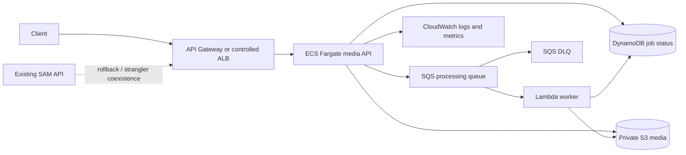

# AWS Event-Driven Media Platform: Cloud Migration, Platform Engineering & DevSecOps

A portfolio project that modernizes an existing asynchronous media-job platform without discarding its working serverless API. The repository demonstrates an incremental migration from AWS SAM/Lambda toward a hybrid platform with an optional containerized API on ECS/Fargate.

> **Evidence boundary:** The SAM stack, container files, Terraform configuration, tests, scripts, and documentation are implemented in this repository. AWS resources, live traffic cutover, production benchmarks, and zero-downtime claims require an AWS account and are not claimed as completed here.

## What exists today

- AWS SAM resources: API Gateway, three Lambdas, private/versioned S3, encrypted DynamoDB, SQS and DLQ.
- Stable asynchronous contract: `POST /jobs` returns `202`; `GET /jobs/{jobId}` returns status.
- Conditional DynamoDB state transitions and SQS partial-batch failure handling.
- Vercel-compatible stdlib demo API and dashboard retained for local/portfolio use.
- Non-root Docker image with health checks and local Compose profile.
- Terraform ECS/Fargate/ECR/IAM/CloudWatch/autoscaling overlay; SAM remains the serverless source of truth.
- Migration preflight, build, smoke-test and rollback helper script.
- Contract and migration tests, OpenAPI contract, CI security and infrastructure checks.

## Architecture



### Existing path and target path

| Boundary | Existing | Modernized target |
|---|---|---|
| API compute | API Gateway + ingest/status Lambda | ECS/Fargate API alongside SAM |
| Async processing | SQS + worker Lambda | Preserved; independently scalable |
| Metadata | DynamoDB | Preserved as system of record |
| Media | Private S3 | Preserved; use presigned uploads for large files |
| Observability | Lambda JSON logs + X-Ray | CloudWatch container logs, metrics and alarms |
| Delivery | SAM deploy via OIDC | Immutable ECR image + controlled ECS promotion |

See [the migration plan](docs/migration-plan.md), [OpenAPI contract](docs/openapi.yaml), and [architecture notes](docs/architecture.md).

## API contract

```bash
curl -X POST http://localhost:8080/jobs \
  -H 'Content-Type: application/json' \
  -d '{"fileName":"video.mp4","contentType":"video/mp4"}'

curl http://localhost:8080/health
curl http://localhost:8080/ready
curl http://localhost:8080/jobs/<job-id>
```

The AWS SAM contract remains compatible with the original implementation. The local container uses the existing `api/index.py` handler and adds `/health` and `/ready`; it does not replace the SAM functions.

## Local setup and tests

Requirements: Python 3.12. AWS SAM CLI and Docker are optional for local-only tests.

```bash
python3 -m venv .venv
source .venv/bin/activate
pip install -r requirements-dev.txt
pytest -q
ruff check src tests
sam validate --lint
sam build
```

### Container workflow

```bash
export GIT_COMMIT_SHA="$(git rev-parse --short HEAD)"
docker build --pull -t event-media-platform:$GIT_COMMIT_SHA -f docker/Dockerfile .
docker run --rm -p 8080:8080 event-media-platform:$GIT_COMMIT_SHA
# Or:
docker compose -f docker/docker-compose.yml up --build
curl http://localhost:8080/health
docker compose -f docker/docker-compose.yml down --remove-orphans
```

The image runs as a non-root user, has a Docker health check, and the Compose profile uses a read-only root filesystem, dropped capabilities, and `/tmp` as a writable tmpfs. Local execution does not require paid AWS services.

## Terraform migration layer

The Terraform module expects an existing VPC and private subnets. It intentionally does not create a second S3/DynamoDB/SQS system of record or destroy the existing SAM stack.

```bash
cd infrastructure/terraform
terraform init -backend=false
terraform fmt -check
terraform validate
terraform plan \
  -var='container_image=<account>.dkr.ecr.<region>.amazonaws.com/event-media-platform:<sha>' \
  -var='vpc_id=vpc-...' \
  -var='private_subnet_ids=["subnet-...","subnet-..."]'
```

For shared state, configure an encrypted S3 backend with locking in an environment-specific wrapper. Never commit `.tfstate`, credentials, or sensitive outputs.

## Migration workflow

```bash
./scripts/migration/migrate.sh preflight
./scripts/migration/migrate.sh build
BASE_URL=http://localhost:8080 ./scripts/migration/migrate.sh smoke
PREVIOUS_IMAGE=<known-good-image> ./scripts/migration/migrate.sh rollback
```

The intended strategy is strangler-style: deploy ECS dark, compare contract and processing behavior, shift selected traffic through a controlled route, observe, then expand. Roll back to the prior ECS image or SAM route if health, errors, latency, queue depth, or data consistency regress. No live cutover was run for this repository.

## CI/CD and DevSecOps

[`platform-ci.yml`](.github/workflows/platform-ci.yml) runs on pull requests and main pushes:

- Ruff, pytest, contract/migration tests, coverage.
- SAM lint/build and Terraform format/init/validate.
- Docker build, Trivy image/dependency scan and Gitleaks.
- Optional SAM deployment with GitHub OIDC when `AWS_DEPLOYMENT_ENABLED=true`.
- Optional immutable ECR publish when `AWS_CONTAINER_DEPLOYMENT_ENABLED=true`.
- Concurrency control and a protected `production` environment prevent overlapping promotions.

Production deployment remains opt-in and should use protected environment approval, a resource-scoped role, and a separate infrastructure promotion step.

## Security and operations

See [security checklist and threat model](docs/security.md), [operations runbook](docs/operations.md), and [rollback guide](docs/rollback.md). Key controls include private encrypted S3, DynamoDB recovery, SQS encryption/DLQ, least-privilege runtime roles, OIDC, immutable ECR tags, non-root containers, input validation, and no secrets in logs.

## Cost and performance

The [cost analysis template](docs/cost-analysis.md) compares Lambda versus Fargate, API handling, storage, queueing, monitoring, network and operational complexity. It deliberately contains no invented benchmark or savings claim. Complete it with the region, workload, duration, concurrency, AWS Pricing Calculator assumptions and measured p50/p95 results.

## Known limitations and next steps

- ECS routing through ALB/API Gateway, live canary traffic, and rollback drills need AWS deployment validation.
- Authentication/authorization, malware scanning, upload size enforcement, and tenant isolation are not production-complete.
- The media worker performs deterministic metadata inspection; integrate MediaConvert, ffmpeg in a sandbox, or Step Functions for real transformations.
- Add an outbox/reconciliation process for the DynamoDB-before-SQS partial-failure window.
- Add CloudWatch dashboards/alarms and load tests after selecting a representative workload.

## Baseline and case study

The baseline on 2026-09-29 was **9 passing tests, Ruff passing, 90% coverage**. The detailed migration case study, risks, compatibility decisions and evidence boundary are in [docs/migration-plan.md](docs/migration-plan.md).

## License

See the repository history and upstream project for licensing terms.
