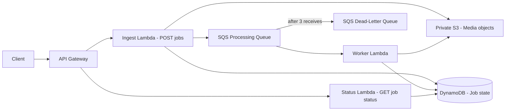

# AWS Event-Driven Media Processing Platform

A production-style, asynchronous media-job API built with AWS SAM. The API accepts metadata quickly, creates a durable job record, stores a private S3 object reference, and publishes a message for background processing. The worker is retry-safe and reports partial batch failures so SQS can retry failed messages and eventually redrive them to a dead-letter queue.

## MediaFlow Jobs Platform (careers marketplace)

An authenticated, LinkedIn/Unstop-style software careers marketplace now runs beside
the media pipeline at **[/careers](https://aws-event-media-platform.vercel.app/careers)**:

- Google / Microsoft OAuth sign-in (demo sign-in until credentials are configured)
- Live opportunity discovery across engineering, data, AI, security, PM,
  internships, hackathons and fellowships — with search, filters and pagination
- Personal shortlist + application Kanban pipeline
  (Saved → Applied → Screening → Interview → Offer / Rejected)
- Private notes, next actions, deduplicated notifications
- Resume/portfolio uploads processed through the existing media pipeline
- Account export and deletion

Endpoints live under `/api/mf/*`; see [docs/jobs-platform.md](docs/jobs-platform.md)
for the API surface, persistence adapters (Postgres / dev), and go-live checklist.

## Career intelligence upgrade

MediaFlow Jobs is now an AI-powered career intelligence platform (see
[docs/career-intelligence.md](docs/career-intelligence.md)):

- **Resume AI** — consent-required, deterministic resume parsing with
  user-correctable extraction (no black box, no fabrication)
- **Explainable matching** — transparent 60/25/15 coverage scoring with
  evidence, missing skills and uncertainty on every job
- **Career roadmaps** — skill-gap reports per target role with real free
  resources and tracked learning progress
- **Pipeline** — SAVED → APPLIED → ASSESSMENT → SCREENING → INTERVIEW →
  OFFER / REJECTED with notes and next actions
- **Employer portal** — company registration (manual verification, no
  auto-badges), job posting, applicant management, party-authorized messaging
- **Trust layer** — human-reviewed listing reports, verification history,
  fraud-caution flags, ingestion-run transparency
- **Privacy** — full account export, resume deletion, consent log
- **Premium job detail** — structured sections (responsibilities, qualifications,
  benefits), 9-stage application tracker with deadlines and activity timeline,
  per-job preparation workspace (truthful cover-letter draft, editable resume
  tips, labeled practice questions), career copilot with grounded answers,
  source & verification history panel
- **In-browser PDF/DOCX resume extraction** (file never leaves the device)
- **Admin analytics** — real usage + data-quality dashboard (`#/admin`)

## ML Engineering & AI Agents

This project now includes a production-minded ML/agent layer on top of the
existing event-driven pipeline: a document agent, an offline evaluation
harness, and CloudWatch metrics. The design goal was the same discipline the
pipeline already has — deterministic, testable, honest — applied to AI.

### Agent architecture (`src/agent/`)

The agent follows a LlamaIndex-style pattern (load -> index -> retrieve ->
answer with citations), implemented with the Python standard library so the
Lambda stays dependency-free. Each stage is a separate module and can be
swapped without touching the others:

- `documents.py` — `Document` model and the job-item -> document loader
- `index.py` — `SearchIndex`, a TF-IDF cosine-similarity retriever (the swap
  point for a real vector store or LlamaIndex later)
- `llm.py` — `LLMProvider` protocol with two implementations: `EchoLLM`
  (default; deterministic, offline, extractive-only — never invents answers)
  and `HttpLLM` (OpenAI-compatible endpoint via stdlib urllib, configured by
  `AGENT_LLM_URL` / `AGENT_LLM_API_KEY` / `AGENT_LLM_MODEL`)
- `tools.py` — `ToolRegistry` with `search_jobs` and `get_job` tools; AWS
  access is injected, never imported by the agent loop
- `prompts.py` — all prompt wording in one place, separate from logic
- `agent.py` — the loop: every question goes through retrieval first, then
  the LLM answers strictly from the retrieved excerpts with `[n]` citations
- `app.py` — Lambda handler behind `POST /agent/query` (scan-bounded index
  build per invocation; `AGENT_INDEX_SCAN_LIMIT`, default 200)
- `cli.py` — the same code paths run locally:
  `PYTHONPATH=src python -m agent.cli query "which jobs failed?"`

Why a deterministic planner instead of LLM tool-calling? Retrieval-first
keeps the agent reproducible, cheap to evaluate offline, and honest about
what the retriever actually found. The LLM only ever composes an answer
from evidence it was handed.

### Offline evaluation (`src/evaluation/`)

- `golden.py` — a small golden set (question -> expected job ids) against
  `tests/fixtures/job_items.json`, fully reproducible with no AWS access
- `evaluate.py` — retrieval metrics (MRR, Precision@k, Recall@k) plus
  `job_success_rate()` for pipeline health over exported job items
- Run: `PYTHONPATH=src python -m agent.cli evaluate` — exits non-zero when
  MRR falls below the configured threshold, so it can gate releases in CI

### Monitoring and observability

Metrics are emitted with CloudWatch Embedded Metric Format (EMF) from
`src/common/metrics.py` — structured JSON logs that CloudWatch turns into
metrics with no extra infrastructure or SDK dependency:

| Metric | Emitted by | Meaning |
| --- | --- | --- |
| `JobOutcome` (outcome=completed/failed) | worker | job processing success rate |
| `JobProcessingLatency` | worker | per-job processing duration |
| `AgentQueryLatency` | agent Lambda | retrieval+answer latency, no_hits visible |
| `AgentQueries` (outcome=ok/error) | agent Lambda | agent usage and error rate |
| `DlqDepth` | `agent.cli dlq-depth` | poison-message backlog |

An engineer monitoring production would watch: success rate by outcome
(alarming on failed > threshold), latency p95s, DLQ depth (each message
there failed 3 processing attempts), and agent error rate / no-hits ratio
(retrieval quality regressions show up as no_hits before they show up as
complaints).

### How this maps to the ML lifecycle

data (job records / media metadata) -> processing (event-driven pipeline)
-> agent & tooling (index + query interface) -> evaluation (golden set,
retrieval metrics, success rate) -> observability (EMF metrics, DLQ depth,
structured logs). Each stage is independently swappable and tested.

### What is deliberately NOT claimed

The retrieval index is TF-IDF, not embeddings; the default LLM is a
deterministic offline provider, not a hosted model. Tests mock all AWS
calls, so nothing here claims production traffic or live model quality —
the interfaces are what make the upgrades drop-in.

## Project links

- [Architecture documentation](docs/architecture.md)
- [AWS SAM infrastructure](template.yaml)
- [CI/CD workflow](.github/workflows/deploy.yml)
- [Test suite](tests/test_platform.py)

## Architecture



## AWS services and rationale

| Service | Purpose |
|---|---|
| API Gateway | Public REST boundary with separate asynchronous create and status routes. |
| Lambda | Stateless ingest, status, and worker compute with no always-on servers. |
| DynamoDB | Durable job state with conditional updates and pay-per-request billing. |
| S3 | Private, encrypted, versioned object storage using `media/{jobId}/{fileName}` keys. |
| SQS | Durable decoupling, retry delivery, visibility timeout, and backpressure. |
| SQS DLQ | Isolates poison messages after three receives for investigation. |
| CloudFormation/SAM | Reproducible infrastructure and least-privilege function policies. |
| GitHub Actions + OIDC | Short-lived AWS authentication without long-lived AWS access keys. |

## API

### `POST /jobs`

Request:

```json
{"fileName":"video.mp4","contentType":"video/mp4"}
```

Returns HTTP `202`:

```json
{"jobId":"uuid","status":"QUEUED","objectKey":"media/uuid/video.mp4"}
```

The platform returns a stable object key. In a production upload flow, the next extension would be a presigned PUT URL so the client uploads directly to S3 without sending media through API Gateway.

### `GET /jobs/{jobId}`

Returns HTTP `200` with `jobId`, `fileName`, `contentType`, `status`, `createdAt`, `updatedAt`, `objectKey`, and `error`. It returns `404` for a missing job and `400` for an invalid UUID.

## DynamoDB schema and state safety

The table uses `jobId` as its partition key. The state machine is:

`QUEUED -> PROCESSING -> COMPLETED` or `PROCESSING -> FAILED`.

The worker uses `ConditionExpression #status = :expected` for every transition. If two SQS deliveries race, only one can claim `QUEUED -> PROCESSING`; the other treats the conditional failure as an idempotent duplicate. Terminal jobs are skipped. This matters because SQS provides at-least-once delivery, so duplicate messages are expected rather than exceptional.

## SQS retries and DLQ

The queue has a 180-second visibility timeout and a redrive policy with `maxReceiveCount: 3`. The worker returns `batchItemFailures` for records that raise exceptions, allowing Lambda/SQS to make the message visible again. After three unsuccessful receives, SQS moves it to the DLQ instead of silently losing it. The worker records useful errors in DynamoDB when it can; if the failure is a database outage, the raised exception preserves retry behavior.

## Security model

The S3 bucket blocks all public access, uses SSE-S3 encryption, versioning, and bucket-owner object ownership. Lambda functions use execution roles generated by SAM policies: ingest can write the table, bucket, and queue; status can read the table; worker can read/write the table and read the bucket. The GitHub deployment role is intended for a dedicated OIDC trust relationship. Do not commit credentials, `.env` files, or access keys.

## Local development

Requirements: Python 3.12, AWS SAM CLI, and Docker for local SAM emulation if desired.

```bash
python3 -m venv .venv
source .venv/bin/activate
pip install -r requirements-dev.txt
pytest
ruff check src tests
sam validate --lint
sam build
```

The tests mock boto3 resources and do not require an AWS account. `events/` contains representative API Gateway and SQS payloads. To invoke locally after `sam build`, use `sam local invoke IngestFunction -e events/post-job.json`.

## AWS deployment

```bash
sam build
sam deploy --guided
```

Choose a unique stack name and region. The deployment creates the API, three Lambdas, DynamoDB table, private S3 bucket, processing queue, DLQ, event source mapping, execution roles, and GitHub OIDC deployment role. The stack outputs the API URL, resource names, and deployment role ARN.

For a real upload workflow, use the returned object key with a future presigned-URL endpoint. The current worker performs a deterministic metadata inspection (`HeadObject`) as a safe, low-cost processing placeholder; the boundary is ready for ffmpeg or an external media service without changing the event contract.

## GitHub OIDC setup

1. Deploy the SAM stack once from a developer machine.
2. In the GitHub repository, create an Actions secret named `AWS_DEPLOYMENT_ROLE_ARN` containing the stack output role ARN.
3. Confirm the template `GitHubRepository` parameter exactly matches `OWNER/REPOSITORY` and `GitHubBranch` matches `main`.
4. The workflow uses `id-token: write` and `aws-actions/configure-aws-credentials`; no AWS access key secret is needed.

If AWS deployment is not ready yet, leave the repository variable `AWS_DEPLOYMENT_ENABLED` unset or set to anything other than `true`. CI validation will still run while the deployment job remains skipped. When ready, set `AWS_DEPLOYMENT_ENABLED=true` and add the `AWS_DEPLOYMENT_ROLE_ARN` secret.

The example deployment role intentionally uses broad CloudFormation deployment actions to keep first-time SAM deployment reliable. For a hardened organization, replace it with a separate bootstrap role and a resource-scoped deployment policy.

## CI/CD

Pull requests run pytest, coverage, Ruff, `sam validate --lint`, and `sam build`. Pushes to `main` run the same checks and then deploy via OIDC. A failed test or validation prevents deployment.

## Observability and debugging

All handlers emit JSON-shaped CloudWatch log entries with `operation`, `status`, and `jobId` when available. For a failed job, inspect the job record first, then the worker log stream and SQS approximate receive count. For repeated failures, inspect the DLQ message and its original message attributes. API Gateway access logs and Lambda error metrics distinguish client validation errors from infrastructure errors. X-Ray tracing is enabled in SAM globals.

## Failure scenarios covered

- Invalid JSON or missing/unsafe fields return `400`.
- Missing job IDs return `404` or `400` as appropriate.
- AWS client errors return a meaningful `503` from API handlers.
- Worker exceptions return SQS batch failures, preserving retries.
- Duplicate SQS deliveries are skipped after conditional state checks.
- Conditional DynamoDB races do not overwrite a newer state.
- Poison messages are isolated by the DLQ policy.

## Cost considerations and trade-offs

Pay-per-request DynamoDB, SQS, Lambda, and API Gateway keep low-volume student usage inexpensive. S3 is private and versioned, which improves recovery but adds storage cost for old versions; apply a lifecycle expiration policy for production data retention. The design favors managed services and at-least-once delivery over exactly-once processing. It uses a metadata processing step instead of bundling a large media codec into Lambda to reduce package size, cold starts, and cost.

## Future improvements

Add presigned upload URLs, S3 event notifications with an outbox/idempotency key, media transcoding via Step Functions or MediaConvert, authentication and per-user authorization, lifecycle policies, alarms for DLQ depth and worker errors, and a resource-scoped bootstrap/deployment role.

## Resume bullets

- Built an AWS SAM event-driven media-processing platform with API Gateway, Python Lambda, DynamoDB, S3, SQS, and a dead-letter queue.
- Implemented conditional DynamoDB state transitions and idempotent SQS worker handling for at-least-once delivery and duplicate events.
- Automated pytest, Ruff, SAM validation/build, and OIDC-authenticated deployments through GitHub Actions without long-lived AWS keys.
- Secured private, encrypted, versioned media storage and documented failure recovery, retry, observability, and cost trade-offs.

## Interview questions to prepare

1. Why is SQS preferable to invoking the worker synchronously from the API Lambda?
2. What exactly does the DynamoDB condition protect against during duplicate delivery?
3. Why return `batchItemFailures` instead of failing the entire SQS batch?
4. What happens if DynamoDB succeeds but SQS send fails after a job is created?
5. How would you implement an outbox or reconciliation process for that partial failure?
6. Why should a client upload media through a presigned S3 URL rather than API Gateway?
7. How would you alarm on DLQ growth and distinguish transient from poison-message failures?
8. Which IAM actions could be narrowed further for a production deployment role?
9. When would you choose Step Functions or MediaConvert over a Lambda worker?
10. What changes are required to support multiple users and authorization?

---

## Vercel deployment (frontend + serverless backend)

The repository is Vercel-ready — the same job API contract, ported from AWS SAM to Vercel serverless functions:

| Piece | Location | AWS equivalent |
|---|---|---|
| Dashboard frontend | `index.html`, `app.js`, `style.css` | — (new) |
| `POST /api/jobs` | `api/jobs.py` | Ingest Lambda + API Gateway |
| `GET /api/jobs/{jobId}` | `api/jobs/[jobId].py` | Status Lambda + API Gateway |
| Job record | signed receipt (HMAC-SHA256), returned by POST and verified on GET | DynamoDB item |
| Async worker | lazy timestamp-driven transitions (QUEUED → PROCESSING → COMPLETED/FAILED) | SQS + worker Lambda |
| Object reference | stable `media/{jobId}/{fileName}` objectKey | S3 private object |

**Design note:** Vercel's runtime is stateless with no built-in database, so the DynamoDB record is replaced by a
tamper-proof signed receipt: the POST response returns it, the client stores it (localStorage) and presents it on
status calls, and the status endpoint verifies the HMAC before reconstructing state. This keeps the full
conditional state machine, `202/200/400/404` contract, and failure semantics without any external database.

**Deploy:** import this repository on [vercel.com/new](https://vercel.com/new) — zero configuration needed
(`vercel.json` included). Optional: set a `JOB_SIGNING_SECRET` environment variable in the Vercel project settings.

**Demo features:** live progress polling, state-machine visualization, simulated worker failure mode
(`"simulate": "failure"`), copyable cURL commands per job.
