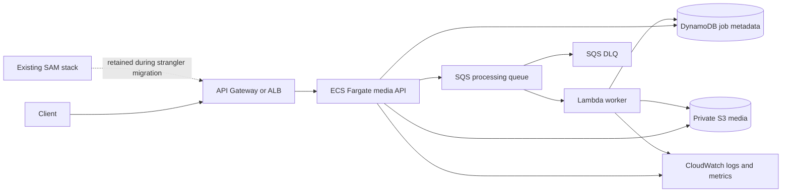

# Platform Migration Plan

## Audit snapshot

The baseline repository contains a Python 3.12 AWS SAM stack (`template.yaml`) with API Gateway, ingest/status/worker Lambdas, S3, DynamoDB, SQS and a DLQ. It also contains a separate Vercel-compatible stdlib API in `api/index.py` used by the dashboard and job-radar demo. Baseline validation on 2026-09-29: **9 tests passed, Ruff passed, 90% coverage**. No AWS deployment was performed in this task.

## Target architecture

The Terraform layer provisions the optional private ECS service, immutable ECR repository, task/execution roles, CloudWatch logs and CPU autoscaling. The SAM stack remains the source of truth for the existing serverless resources and can continue serving traffic during migration.

## Strangler sequence

1. **Preflight:** run `scripts/migration/migrate.sh preflight`; verify AWS account, networking, image registry, parameter values and API contract.
2. **Build and scan:** build with the commit SHA as the image tag; ECR scan-on-push is enabled in Terraform. CI also runs dependency and secret scans.
3. **Deploy dark:** apply Terraform into private subnets with `desired_count >= 2`; expose it only through an internal integration or controlled ALB/API Gateway route.
4. **Smoke test:** run health, readiness and `POST /jobs` contract checks against the new service.
5. **Shift traffic:** route selected endpoints or a small canary percentage to ECS while retaining SAM as rollback target. This repository does not claim zero downtime without a live load balancer/canary test.
6. **Observe:** compare request errors, latency, queue depth, DLQ messages, job outcomes and metadata consistency.
7. **Expand or rollback:** increase traffic only after the agreed SLO window; otherwise restore the previous task definition or route to SAM with `scripts/migration/migrate.sh rollback`.

## Compatibility and risks

- The AWS SAM API contract remains `POST /jobs` -> `202` and `GET /jobs/{jobId}` -> `200/400/404`.
- Large media should use S3 presigned uploads; queue messages carry identifiers, not file bytes.
- DynamoDB conditional state transitions and SQS at-least-once delivery remain the idempotency boundary.
- The Vercel implementation uses signed receipts and is not a drop-in replacement for DynamoDB; it is retained as a local/demo fallback.
- Real DNS, ALB/API Gateway routing, AWS credentials, and live data consistency tests remain deployment-stage work.
